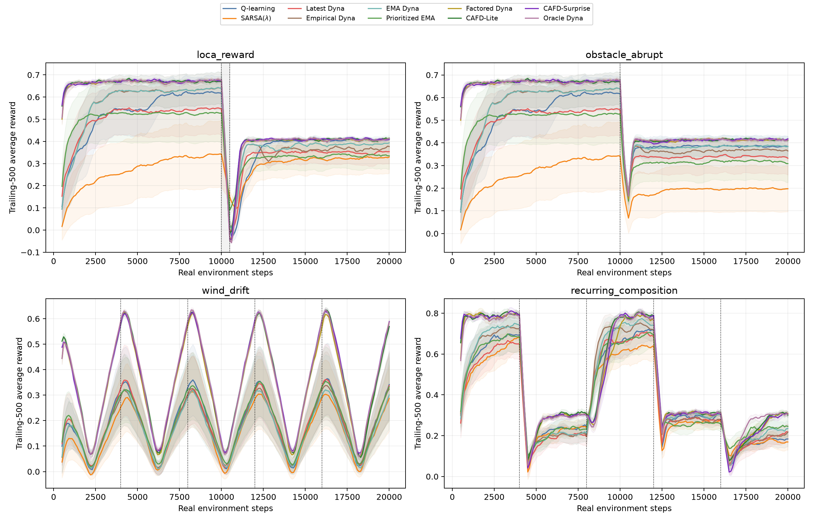
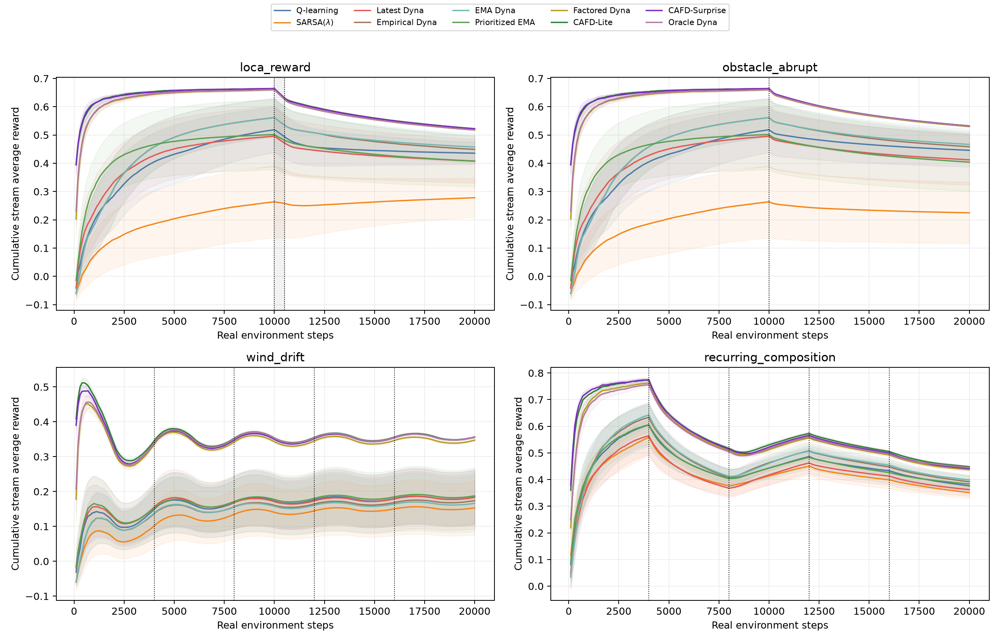
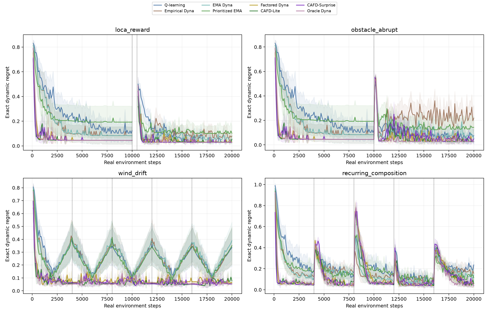
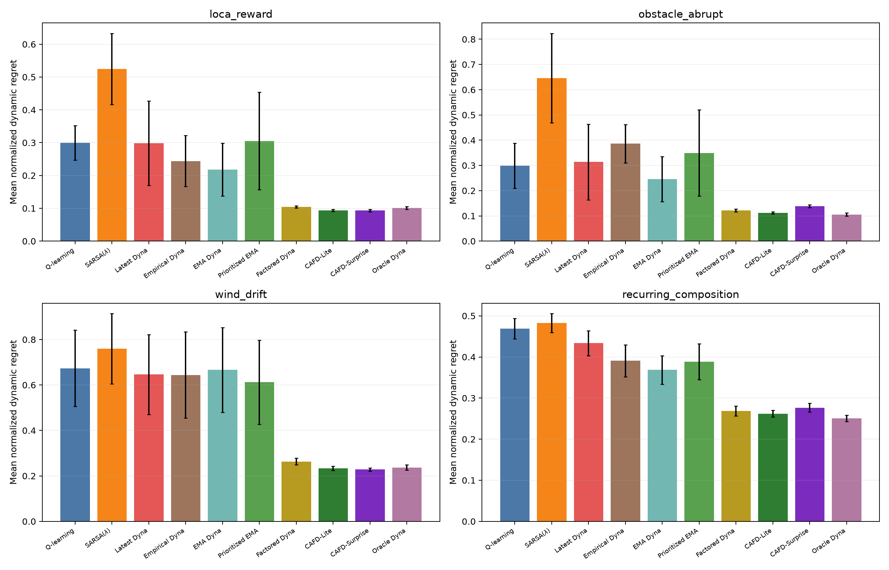
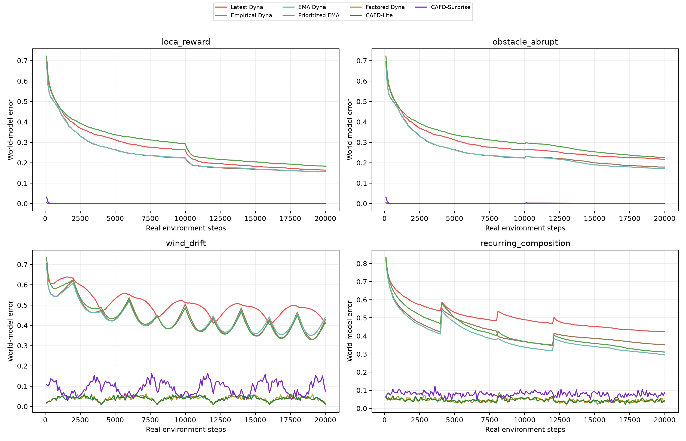
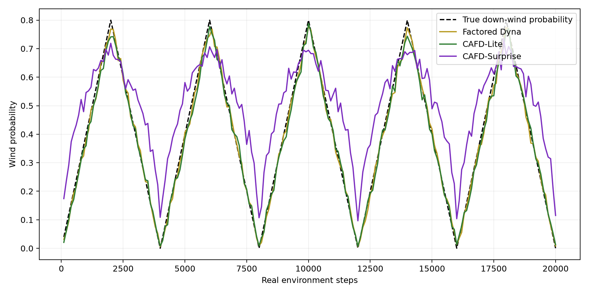

# Phase 6–9：Continual MBRL 实验与结论

## 1. 执行结论

Phase 6–9 的核心主线已经实现并完成正式实验。结果支持一个比“MBRL sample efficiency 更高”更具体的结论：

> 在这个 continuing、average-reward、non-stationary grid 中，优势主要不来自“有一个 replay model”本身，而来自把环境分解为可复用的稳定结构和少量可快速跟踪的动态因子。结构化 factored Dyna 在 abrupt reward、abrupt obstacle、smooth wind drift 和 recurring/compositional contexts 中都显著降低 dynamic regret；在其上加入少量 change-prioritized planning，在前三类环境中产生进一步的显著改善。

同时，实验不支持“只要使用 Dyna 或 surprise adaptation 就会更强”：

- Latest、Empirical、EMA 等非结构化 Dyna 在多个场景中只略优于或不优于 model-free baseline；
- 在非结构化 EMA model 上加入 prioritized sweeping 没有稳定收益；
- CAFD-Surprise 只在 smooth wind drift 中取得数值最优，但相对固定学习率 CAFD 的差异不显著，并在 abrupt obstacle 与 recurring composition 中显著更差；
- perfect-model Dyna 也不总是曲线最优，因为 world model 完美并不能消除 function approximation、有限 planning distribution 和 bootstrapping interference。

因此，目前最稳健的方法是 **CAFD-Lite**，不是更复杂的 CAFD-Surprise。

## 2. Continuing protocol

所有实验严格采用 continuing average-reward protocol：

- 没有 episodic termination；
- 到达 goal 后得到奖励并从左侧公共区域随机重启，这是 continuing MDP 的普通 transition，不是 episode reset；
- context 变化不清空 value weights、eligibility trace、world model 或 average-reward estimate；
- 每个 run 连续运行 20,000 real environment steps；
- 每 100 real steps 记录一次数据，共 200 个诊断点；
- “评估”是对当前在线 learner 的冻结策略做只读 exact Markov-chain evaluation，不保存/加载权重、不执行单独 evaluation episodes，也不改变训练 stream；
- 主指标是当前 frozen context 下的 oracle average reward gain 与 learner 当前策略 gain 之差，即 exact dynamic regret。

归一化指标为

\[
\text{normalized regret}_t=
\frac{g_t^*-g_t^{\pi_t}}{\max(0.1,|g_t^*|)}.
\]

这避免了 stochastic rollout evaluation 的额外方差，也符合 continual learning 中“任何时刻都能检查当前策略质量”的含义。

## 3. Phase 6：non-stationary diagnostic environments

### 3.1 基础地图

环境是 `7 × 7` two-goal/two-corridor grid：

- 中间有一道竖墙，只在上、下两个 corridor 留有通路；
- Goal A 位于 `(6, 1)`，Goal B 位于 `(6, 5)`；
- 普通 step reward 为 `−0.05`，collision reward 为 `−0.25`；
- 到达 goal 后从 `x=0` 的七个合法位置均匀重启；
- observation 使用 Phase 0–5 已验证的 MultiGroupTileCoder 输入，包括位置、伪目标与 local wall mask；
- dynamic factors 包括 goal reward heads、categorical wind 和两个 corridor edge 的 blocked probability。

### 3.2 四个场景

| 场景 | 20k-step schedule | 研究问题 |
|---|---|---|
| `loca_reward` | 0–10k：A=6/B=4；10k 后 A=1/B=4；10k–10.5k 只在 A 附近观察变化，之后回到公共决策区 | 局部观察到的新 reward 能否在未重新遍历全图前传播到远端 choice point？ |
| `obstacle_abrupt` | 10k 时 upper corridor block probability 从 0 跳到 1 | 局部 dynamics change 能否被模型传播？ |
| `wind_drift` | down-wind probability 每 4k steps 做 `0 → 0.8 → 0` triangular drift，共五个周期 | 模型能否持续跟踪平滑 latent dynamics？ |
| `recurring_composition` | 每 4k steps 依次为 A/right、B/left、A/right recurrence、未见过的 A/left 组合、B/left recurrence | 能否保留、重用并组合已经学到的 factors？ |

LoCA 的 500-step local observation window 会改变 agent 所在状态分布，但不会重置 learner，也不存在 termination。该窗口内不是公共 choice test，因此主 regret 曲线将其标为无效区间并留空。

### 3.3 Scenario validator

Oracle 检查确认 change 是 policy-relevant 的：

| Change | Optimal-action disagreement | 旧策略在新环境中的 average-reward regret |
|---|---:|---:|
| LoCA reward A→B | 50.0% | 0.2218 |
| Upper corridor open→blocked | 28.6% | 0.6924 |
| Recurring/composition 相邻变化 | 35.7%–50.0% | 0.0233–0.5103 |

Wind 是连续变化，不能只用单个 switch 概括；极端 context 的 oracle policy disagreement 达到约 19%。

## 4. Phase 7：adaptive Dyna baselines

正式比较包括：

| 方法 | World model / planning |
|---|---|
| Q-learning | 无 model，无 planning |
| SARSA(λ) | 无 model，real-stream traces |
| Latest Dyna | 每个 `(s,a)` 只保留最近 outcome |
| Empirical Dyna | 累积全部历史经验分布，无 forgetting |
| EMA Dyna | 对 outcome distribution 做 exponential recency update |
| Prioritized EMA | 同一 EMA model，使用 expected prioritized backups |

Pilot 在三个 development scenarios、每个配置 3 seeds 上选择统一超参数，而不是按 test scenario 单独调参：

- EMA decay candidates：`0.90 / 0.97 / 0.99`，选择 `0.97`；
- factor learning-rate candidates：`0.02 / 0.05 / 0.10`，选择 `0.05`。

所有 Dyna 方法每个 real step 最多使用 5 次 planning backups，value representation 与 real-update rule 保持一致。

## 5. Phase 8：Change-Aware Factored Dyna

### 5.1 Factored model

Factored model 明确区分：

- stable grid mechanics 与固定墙体结构；
- global categorical wind：`none/up/right/down/left`；
- upper/lower corridor 的 local block probability；
- Goal A 与 Goal B 的独立 reward heads。

这里必须披露一个重要 inductive bias：模型预先知道坐标动作机制和固定墙体布局；wind、dynamic edge availability 和 goal rewards 则完全从在线 interaction 学习。因而结果证明的是“合适结构先验下的 factor reuse”，不是从 pixels 或未知拓扑中自动发现因果结构。

### 5.2 三个结构化变体

- **Factored Dyna / `cafd_uniform`**：固定 factor rate，5 次 uniform model samples；这是 factorization-only ablation。
- **CAFD-Lite**：相同 factored model，每步 1 次 prioritized expected backup + 4 次 uniform model samples；总 planning budget 仍为 5。
- **CAFD-Surprise**：与 CAFD-Lite 相同，但用 prediction surprise 调节 factor learning rate，范围 `[0.01, 0.30]`。

Priority queue 会根据 changed factors 影响的 predecessor state-actions 传播 model revision。直接把 5 次 planning 全部改成 priority 在 function approximation 下会加剧局部 backup interference，因此最终协议使用 `1 prioritized + 4 uniform` 的混合方案。

### 5.3 Model error

每 100 steps 在全部 state-actions 上计算

\[
E_M=0.8\,\mathrm{TV}(\hat P,P)
+0.2\min\left(1,\frac{|\hat r-r|}{6}\right).
\]

未覆盖的非结构化 model key 记为 error 1。该指标同时测量 transition marginal 与 expected reward，但它是全局模型误差，不一定和 control-relevant error 完全一致。

## 6. Phase 9：正式实验规模与统计

- 4 scenarios × 10 methods × 20 paired seeds = **800 formal runs**；
- 每个 run 20,000 steps，共 **16,000,000 real environment steps**；
- 总 planning backups 为 **63,999,671**；
- 另有 54 个 10k-step development pilot runs；
- paired methods 共享 environment seed；
- 主曲线显示 20 seeds 的 mean 与 95% CI；
- 方法差异使用 seed-level paired difference，并以 10,000 次 deterministic paired bootstrap 给出 95% percentile CI；
- hyperparameter selection 与 final seeds 分离，final settings 不再按场景调参。

完整测试通过：`python -m unittest discover -s tests -v`，**72/72 tests passed**。

## 7. 主结果

下表是全 stream 的 mean normalized dynamic regret，`±` 后为 95% CI；越低越好。

| Method | LoCA reward | Abrupt obstacle | Wind drift | Recurring/composition |
|---|---:|---:|---:|---:|
| Q-learning | 0.2990 ± 0.0525 | 0.2987 ± 0.0893 | 0.6735 ± 0.1681 | 0.4691 ± 0.0248 |
| SARSA(λ) | 0.5248 ± 0.1082 | 0.6461 ± 0.1770 | 0.7597 ± 0.1542 | 0.4826 ± 0.0228 |
| Latest Dyna | 0.2986 ± 0.1290 | 0.3136 ± 0.1497 | 0.6460 ± 0.1754 | 0.4335 ± 0.0303 |
| Empirical Dyna | 0.2440 ± 0.0775 | 0.3861 ± 0.0756 | 0.6439 ± 0.1895 | 0.3906 ± 0.0391 |
| EMA Dyna | 0.2179 ± 0.0800 | 0.2461 ± 0.0894 | 0.6661 ± 0.1864 | 0.3684 ± 0.0347 |
| Prioritized EMA | 0.3049 ± 0.1485 | 0.3493 ± 0.1704 | 0.6123 ± 0.1846 | 0.3883 ± 0.0438 |
| Factored Dyna | 0.1044 ± 0.0030 | 0.1216 ± 0.0056 | 0.2635 ± 0.0143 | 0.2684 ± 0.0122 |
| **CAFD-Lite** | **0.0933 ± 0.0031** | **0.1118 ± 0.0037** | 0.2332 ± 0.0091 | **0.2618 ± 0.0082** |
| CAFD-Surprise | 0.0934 ± 0.0036 | 0.1390 ± 0.0055 | **0.2287 ± 0.0070** | 0.2766 ± 0.0109 |
| Perfect-model Dyna | 0.1008 ± 0.0043 | 0.1050 ± 0.0063 | 0.2370 ± 0.0112 | 0.2503 ± 0.0077 |

相对 Q-learning，CAFD-Lite 的 normalized regret 分别降低约：

- LoCA：68.8%；
- abrupt obstacle：62.6%；
- wind drift：65.4%；
- recurring/composition：44.2%。

四个 paired bootstrap CI 均排除 0，详细数据见 `paired_vs_q_learning.csv`。

## 8. 关键机制消融

下表报告 treatment − control 的 paired mean normalized-regret difference；负值表示加入机制后更好。括号是 paired-bootstrap 95% CI。

| 机制比较 | LoCA | Obstacle | Wind | Recurring/composition |
|---|---:|---:|---:|---:|
| EMA − Empirical | −0.0260 `[-0.0332, −0.0191]` | −0.1400 `[-0.1582, −0.1190]` | +0.0222 `[+0.0037, +0.0406]` | −0.0223 `[−0.0484, +0.0081]` |
| Prioritized EMA − EMA | +0.0870 `[−0.0751, +0.2510]` | +0.1032 `[−0.0811, +0.2890]` | −0.0539 `[−0.2911, +0.1937]` | +0.0199 `[−0.0344, +0.0715]` |
| **CAFD-Lite − Factored uniform** | **−0.0111 `[-0.0145, −0.0077]`** | **−0.0097 `[-0.0150, −0.0045]`** | **−0.0304 `[-0.0457, −0.0141]`** | −0.0066 `[−0.0227, +0.0108]` |
| Surprise − fixed CAFD | +0.0002 `[−0.0032, +0.0037]` | **+0.0271 `[+0.0210, +0.0330]`** | −0.0044 `[−0.0157, +0.0069]` | **+0.0147 `[+0.0043, +0.0244]`** |

由此可得：

1. **Factorization 是最大、最稳定的增益来源。** 非结构化模型必须分别学习大量 `(s,a)` outcomes；factored model 用任何位置获得的 wind evidence 更新全地图预测，并将 reward/edge change 限制在相应 factor。
2. **Priority 只有和可传播的结构化 model revision 配合时才稳定有用。** 在 factored model 上，priority 对 LoCA、obstacle 和 wind 的增益显著；在非结构化 EMA 上，四个场景都没有显著收益。
3. **固定 forgetting 不是处处有效。** EMA 明显改善 LoCA 和 obstacle，却在周期 wind drift 中显著劣于 empirical model。这说明单个固定 decay 与 drift timescale 可能失配。
4. **Surprise adaptation 暂未成为可靠贡献点。** 它在 wind 上数值最好，但相对 fixed CAFD 不显著；在 abrupt obstacle 和 recurring/composition 上显著更差。这是明确的 failure boundary，而不是应隐藏的负结果。

## 9. 如何阅读四张核心图

### 9.0 Online average-reward curves

这是最直观的 online-control 主图。每个 run 原始记录了连续、互不重叠的 100-step reward sums；图中每个点精确合并最近五个 blocks，因此是在每 100 steps 处计算的 trailing-500 average reward，并非从稀疏采样 reward 近似出来的。它能显示 context change 后的即时损失和恢复。

这张图显示从 step 1 到当前时刻的累计 reward / elapsed steps，与最终 aggregate table 中的 `stream_average_reward` 定义一致。它适合回答整个部署过程总共获得多少收益，但会被早期历史稀释，不适合作为 adaptation speed 的唯一曲线。

### 9.1 Dynamic regret curves

- 横轴是真实 environment interaction steps，纵轴是当前策略相对当前 context oracle 的 exact dynamic regret；越低越好；
- 竖虚线是 context event，不代表 episode boundary；
- LoCA 10k–10.5k 的空白是 local-observation intervention，公共 choice policy 在此阶段没有可比含义；
- 上排 abrupt changes 中，factored methods 在 change 后快速回落；
- wind 中非结构化方法的 regret 随 drift 大幅起伏，而 factored methods 保持在低位；
- recurring 图中每次 context change 都造成 spike，但 factored methods 的重新适应明显更快。

### 9.2 Overall regret summary

柱高是每个 run 全部有效诊断点上的 normalized regret 均值，再对 20 seeds 取均值；误差棒是 95% CI。它回答“整个 continual stream 中平均落后当前最优策略多少”，不是只看最后 10% 的 tail performance。

### 9.3 World-model tracking

- 非结构化 Latest/Empirical/EMA 的全局 model error 长期约为 `0.15–0.45`；
- factored fixed-rate / CAFD-Lite 在 abrupt 场景 tail error 约 `0.0005–0.0009`，在 wind/recurring 场景约 `0.038–0.040`；
- 这张图是“学习环境本质”的最直接证据：模型把变化投影到少量可解释因子，而不是等待每个 state-action 被重新访问；
- 但 global model error 不是 policy regret 的充分解释。例如 CAFD-Surprise 在 wind 的 tail error 为 `0.0914`，高于 CAFD-Lite 的 `0.0377`，其 regret 却略低且差异不显著，说明 control-relevant accuracy 和全局平均误差并不等价。

### 9.4 Wind factor tracking

黑色虚线是真实 down-wind probability。Factored Dyna 与 CAFD-Lite 能持续跟踪五个 `0→0.8→0` 周期。CAFD-Surprise 有明显相位滞后和低值偏置；这解释了为什么不能把其极小的 regret 数值优势解释成“模型估计更准确”。

## 10. Compute accounting

平均单个 20k-step run 的 wall-clock time 大致为：

| Family | Seconds/run |
|---|---:|
| Q-learning | 5.6–7.1 |
| Empirical / EMA Dyna | 12.1–14.7 |
| Factored uniform | 24.3–26.2 |
| Prioritized EMA | 47.1–73.7 |
| CAFD-Lite / Surprise | 51.5–56.1 |
| Perfect-model Dyna | 18.2–21.2 |

因此，当前结果是 **environment-step matched 且 planning-update matched**，不是 wall-clock matched。CAFD 的 data efficiency / adaptation advantage 是清楚的，但计算代价约为 Q-learning 的 8–10 倍、普通 Dyna 的 4 倍左右。论文中不能省略这一点。

## 11. 对最初研究问题的回答

### 11.1 环境是否太简单？

Phase 0–5 的 stationary competence gate 已证明所有主要方法能解决基础任务。Phase 6 的 oracle validator 又证明每个 change 确实改变 optimal policy，并让旧策略产生非零 regret。因此，当前差异不是由“model-free 根本不会走迷宫”造成，也不是只比较一个所有方法都饱和的简单终局指标。

### 11.2 是否应该使用 drift，而不是全是 abrupt change？

应该同时保留二者，而不是二选一。本实验给出了互补结论：

- LoCA reward / abrupt obstacle 检验局部变化传播；
- triangular wind 检验持续 tracking；
- recurring/composition 检验 knowledge reuse。

只做 abrupt change 会把 change detection 与 tracking 混在一起；只做 smooth drift 又会错过 model-based counterfactual propagation 的优势。

### 11.3 Tabular model 是否是问题？

问题不在于 table 这种存储形式本身，而在于模型是否把每个 `(s,a)` 当成彼此无关的 entry。实验中非结构化 Dyna 即使有 forgetting，仍不能把一处观察到的 wind/reward/edge evidence 传播为全地图一致的预测；factored model 能做到。因此，要强调的是 **generalizing world model / causal factorization**，不必为了“非 tabular”而盲目换成神经网络。

### 11.4 Dyna-Q 是否太简单？

Vanilla Dyna 的确不足以支持“理解环境本质”的主张。当前结果表明，需要至少区分三件事：

1. model freshness；
2. model structure and factor reuse；
3. planning allocation。

其中第二项贡献最大，第三项在结构化模型上提供追加收益，第一项单独使用并不稳健。

## 12. 限制与下一轮最有价值的研究

本轮完成的是 Phase 6–9 的核心、时间受限版本，以下原计划扩展没有被包装成已完成结论：

- wind 只正式测试了 4k-period triangular schedule，尚未做 `T={500,2000,8000}`、bounded random walk 或 train/test schedule-family split；
- obstacle 只测试 abrupt block，尚未测试 smooth block-probability drift；
- CAFD 使用已知 stable mechanics / wall-layout prior，尚未让模型从经验学习 topology；
- 没有加入 hidden-context belief、confidence-weighted planning 或 optional context bank；
- held-out A/left composition 位于同一 stream 中，但还没有单独的 environment-instance generalization split；
- 尚未提供 wall-clock matched / equal-compute control；
- 尚未做 neural world model baseline，因此不能把结论推广到高维 observation。

最合理的下一步不是立刻堆更复杂的 neural model，而是：

1. **Drift generalization matrix**：用 triangular `T=2000` 调参，在 `T={500,8000}` 和 bounded random walk 上测试；
2. **Learned-structure ablation**：依次移除已知 wind residual、fixed wall layout 和 goal identity，量化每项 structural prior 的价值；
3. **Compute-matched comparison**：将 CAFD planning budget从 5 sweep 到 1/2/5，并给 Q/EMA 更多 real or replay updates；
4. **Surprise redesign**：对不同 factor 使用独立 surprise 与 learning rate，避免一次罕见 transition 同时扰动无关因素；
5. **Context retrieval only after the above gates**：在 recurring stream 加 factor prototype bank，并与不带 bank 的 CAFD-Lite 做 paired reacquisition comparison。

如果只保留一个可在暑校 final project 中讲清楚、证据最完整的创新点，建议主张：

> **Change-Aware Factored Dyna：通过稳定动力学结构、可在线跟踪的动态因子和少量 change-prioritized backups，在 continuing average-reward 环境中将局部经验转换为全局一致的 world-model revision，从而降低 abrupt、drift 和 recurring changes 下的 dynamic regret。**

其中 CAFD-Lite 是主方法，Factored Dyna 是关键消融，CAFD-Surprise 应作为有价值但尚未稳定的探索性扩展。

## 13. 产物索引

- 正式实验入口：[run_phase6_9.py](run_phase6_9.py)
- 实验实现：[stream_rl_grid/research/phase6_9_pipeline.py](stream_rl_grid/research/phase6_9_pipeline.py)
- 动态环境：[stream_rl_grid/research/continual_environment.py](stream_rl_grid/research/continual_environment.py)
- Factored models：[stream_rl_grid/research/adaptive_models.py](stream_rl_grid/research/adaptive_models.py)
- 完整 aggregate table：[phase6_9_summary/aggregate_summary.csv](phase6_9_summary/aggregate_summary.csv)
- 每 100 steps 数据：[phase6_9_summary/stepwise_summary.csv](phase6_9_summary/stepwise_summary.csv)
- 相对 Q-learning 的 paired statistics：[phase6_9_summary/paired_vs_q_learning.csv](phase6_9_summary/paired_vs_q_learning.csv)
- 机制消融 paired statistics：[phase6_9_summary/paired_mechanism_ablations.csv](phase6_9_summary/paired_mechanism_ablations.csv)
- 自动统计摘要：[phase6_9_summary/STATISTICAL_CONCLUSIONS.md](phase6_9_summary/STATISTICAL_CONCLUSIONS.md)
- Scenario validation：[experiment_results/phase6_9/scenario_validation.json](experiment_results/phase6_9/scenario_validation.json)
- Pilot selection：[experiment_results/phase6_9/pilot_summary.csv](experiment_results/phase6_9/pilot_summary.csv)
- Protocol manifest：[experiment_results/phase6_9/experiment_manifest.json](experiment_results/phase6_9/experiment_manifest.json)
- 800-run scalar summary：[experiment_results/phase6_9/final_run_summary.csv](experiment_results/phase6_9/final_run_summary.csv)
- 每个 seed 的完整 200-point curves：[experiment_results/phase6_9/final_runs](experiment_results/phase6_9/final_runs)
