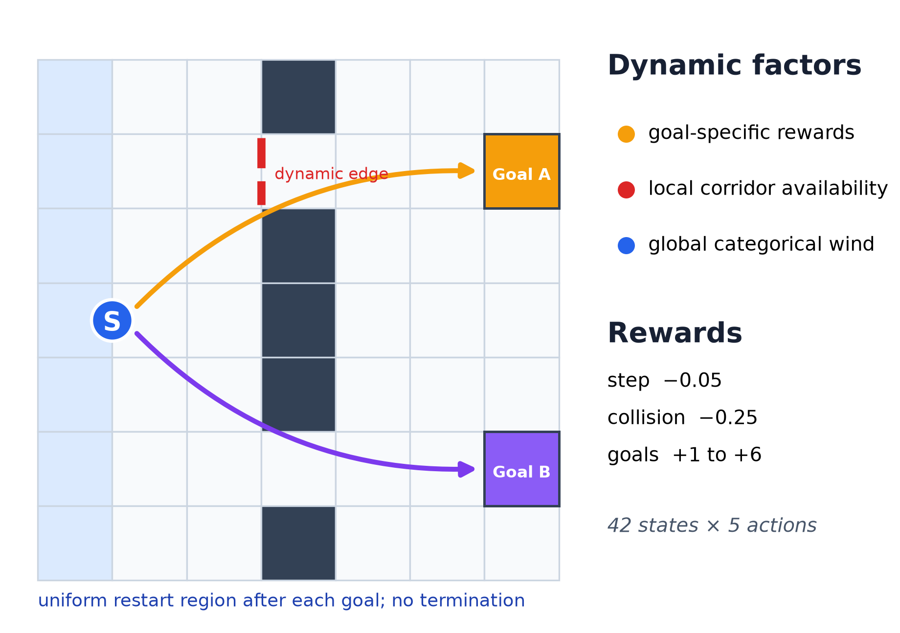
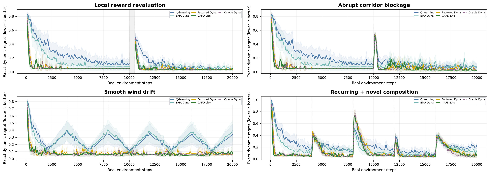
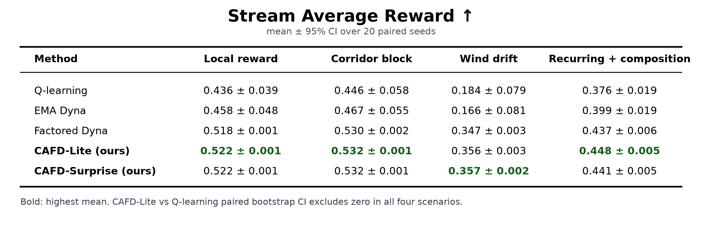
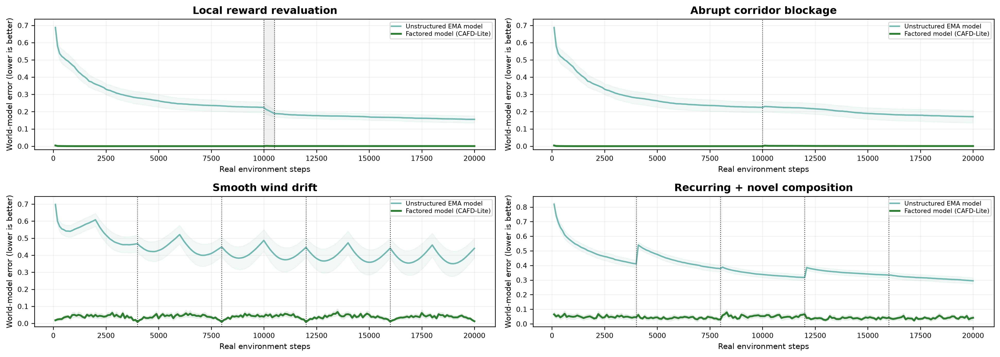

# Beyond Sample Efficiency: Learning Reusable Environment Mechanisms for Continual Reinforcement Learning

**Change-Aware Factored Dyna for Rapid Adaptation to Local Change, Drift, and Recurrence**

> **Takeaway:** A model helps continual control when it represents reusable mechanisms—not when it only memorizes transitions.

## 1. Motivation

Can MBRL do more than reuse data? We test whether model structure can isolate changes, preserve stable knowledge, and revise unvisited decisions.

## 2. Environment Design

A continuing $7\times7$ two-goal grid: 42 states, 5 actions, and no termination or learner reset.

- Rewards: step $-0.05$, collision $-0.25$, goals $+1$ to $+6$.
- Hidden context; position/reference/wall-mask observation.
- 22 active tile-coded features per state–action pair.

## 3. Experimental Design and Results

| Scenario | Diagnostic question |
|---|---|
| Local reward revaluation | Does local evidence alter a distant choice? |
| Abrupt corridor blockage | Does a dynamics change propagate? |
| Smooth wind drift | Can a latent transition factor be tracked? |
| Recurring + novel composition | Can factors be retained and recombined? |

**Protocol:** 20 paired seeds, 20k steps/run, 800 runs, no resets.

$$
\text{Dynamic Regret}_t=g_t^*-g_t^{\pi_t}\qquad\text{lower is better}
$$

Factorization creates the main performance gap; mixed prioritized planning adds a smaller benefit.

CAFD variants achieve the highest learned-method reward in every scenario.

The factored model maintains far lower prediction error than unstructured EMA Dyna.

## 4. Proposed Algorithm: CAFD-Lite

$$
M_t=\left\{M_{\mathrm{stable}},\;p_t(w),\;p_t(\mathrm{block}\mid e),\;r_t^A,\;r_t^B\right\}
$$

CAFD-Lite separates known grid mechanics from learned wind, corridor, and reward factors. Each real step uses **1 prioritized backup + 4 uniform model samples**.

One observation can revise every prediction governed by the same factor.

## 5. Conclusions

- **Structure matters:** CAFD-Lite reduces regret versus Q-learning by 44–69%.
- **Real reward improves:** $+0.072$ to $+0.172$; all paired intervals exclude zero.
- **Planning needs structure:** priority helps when model revisions generalize.
- **A model alone is insufficient:** unstructured Dyna is inconsistent.

**Shown:** Q-learning, EMA Dyna, Factored Dyna, CAFD-Lite, Oracle Dyna.
