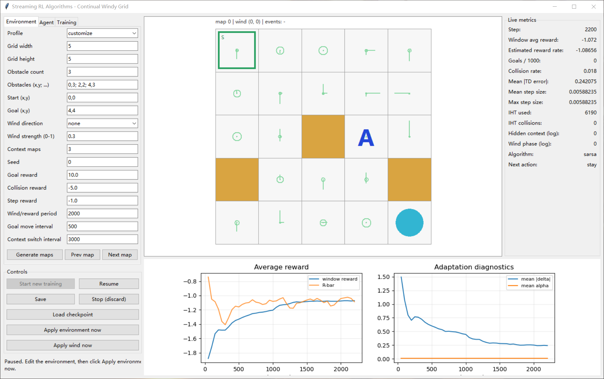

# stream-rl-grid

[](#english)[](README_zh-CN.md)

A Windy Grid World designed for continual learning experiments. Each transition is used only once, with no replay buffer, no batches, and no episode termination. The agent uses:

**Streaming Differential Sarsa(λ) + replacing traces + dual-group tile coding + TIDBD**.

This project draws on:

- the per-sample online updates and eligibility-trace ideas from `Streaming Deep Reinforcement Learning Finally Works`;
- the per-feature step-size adaptation method from `TIDBD: Adapting Temporal-difference Step-sizes Through Stochastic Meta-descent`.



## Algorithm

The action-value function is linear:

$$Q(s, a) = w^T x(s, a)$$

The Differential Sarsa TD error does not include a discount factor:

$$\delta = r + Q(s', a') - Q(s, a) - \bar{R}$$

The average-reward estimate is updated as:

$$\bar{R} \gets \bar{R} + \eta \delta$$

The eligibility trace uses replacing traces:

$$
z \gets \lambda z \\
z_{\text{active}} \gets 1
$$

For each weight, TIDBD maintains $\beta_i = \log \alpha_i$ and the meta-trace $H_i$:

$$
\beta_i \gets \beta_i + \theta \delta x_i H_i \\
\alpha_i \gets \exp(\beta_i) \\
w_i \gets w_i + \alpha_i \delta z_i \\
H_i \gets H_i \max(0, 1 - \alpha_i x_i z_i) + \alpha_i \delta z_i
$$

ObGD is intentionally not combined with the implementation, because doing so would alter the experimental interpretation of TIDBD. Only loose numerical bounds on `beta` are imposed, together with NaN/Inf detection.

## State and Function Approximation

The agent observes:

$$
(current_x, current_y, goal_x, goal_y, previous\_action)
$$

It cannot observe the wind phase, reward phase, map-mode identifier, or global clock.

Two groups of tile codings encode:

1. the absolute position `(x, y, previous_action, candidate_action)`;
2. the position relative to the goal `(goal_x-x, goal_y-y, previous_action, candidate_action)`.

An additional categorical bias feature is included. By default, each group uses 8 tilings, resulting in 17 active features per step under normal conditions.

## Continuing-Environment Rules

- The available actions are up, right, down, left, and stay;
- the `stay` action is still affected by wind;
- the displacement caused by the selected action and by the wind is executed one grid cell at a time;
- if any intermediate step hits a boundary or obstacle, the entire transition is cancelled, the agent remains at its pre-action position, and a collision penalty is issued;
- after reaching the goal, the agent receives the goal reward and is immediately teleported to a randomly selected valid non-goal cell;
- the environment always returns `terminated=False, truncated=False`;
- eligibility traces are not cleared when the goal is reached, the wind season changes, the goal moves, or the map switches;
- when the map switches, if the agent's current cell is an obstacle in the new map, that obstacle remains temporarily inactive and is activated immediately after the agent leaves the cell.

## Structured Non-Stationarity

The graphical interface provides five configurations:

- `stationary`: fixed wind, goal, reward, and map;
- `seasonal_wind`: the wind direction and reward multiplier cycle with a fixed period;
- `moving_goal`: the goal moves slowly back and forth along a fixed serpentine trajectory, skipping trajectory points occupied by obstacles;
- `hidden_context`: the obstacle map switches periodically, but the map-mode identifier is not provided to the agent;
- `combined`: enables all three types of change described above at the same time.

The map generator guarantees that all valid cells remain connected. In the interface, an obstacle can be moved by first clicking the obstacle and then clicking an empty cell. Any modification that breaks connectivity is rejected.

## Launching the Graphical Interface

Python must be installed with Tk support. After installing the dependencies, run the following command from the repository root:

```powershell
python run_gui.py
```

The interface supports:

- configuration of the environment, rewards, scheduling periods, and algorithm hyperparameters;
- map generation, contextual-map previews, and manual obstacle relocation;
- start, pause, resume, manual save, and stop-and-save operations;
- checkpoint loading and exact training resumption;
- real-time visualization of the grid, average reward, goal-reaching rate, collision rate, TD error, and TIDBD step sizes.

Training runs in a background thread, and the GUI is not part of the agent's observation.

## Running Without the Graphical Interface

Run for a fixed number of steps:

```powershell
python -m stream_rl_grid.cli --profile combined --steps 50000
```

Run indefinitely, then press `Ctrl+C` to stop and save automatically:

```powershell
python -m stream_rl_grid.cli --profile combined --steps 0
```

Resume training exactly:

```powershell
python -m stream_rl_grid.cli --resume checkpoints/<run-id>/step-000000050000.pkl --steps 0
```

Run the fixed-step-size baseline:

```powershell
python -m stream_rl_grid.cli --profile stationary --fixed-alpha --steps 50000
```

## Multi-Seed Evaluation

Compare TIDBD with fixed-step-size Differential Sarsa:

```powershell
python -m stream_rl_grid.benchmark --steps 50000 --seeds 0 1 2 3 4
```

The outputs include a CSV file for each run, the mean learning curve, and a 95% normal-approximation confidence interval. The primary metric is the moving-window average reward; episode return is not used.

## Checkpoint Contents

A checkpoint stores more than just `w`. It also contains:

- `w, beta, H, z, R_bar`;
- the current observation and the already selected next action;
- the environment position, goal, map, and wind/reward/map scheduling phases;
- deferred obstacle activations;
- the IHT dictionary and collision count;
- the Python and NumPy random-number-generator states;
- moving metrics, curves, configuration, and format version.

Saving uses a temporary file followed by an atomic replacement, preventing an interrupted save from leaving behind a partial checkpoint.

## Tests

```powershell
python -m unittest discover -s tests -v
```